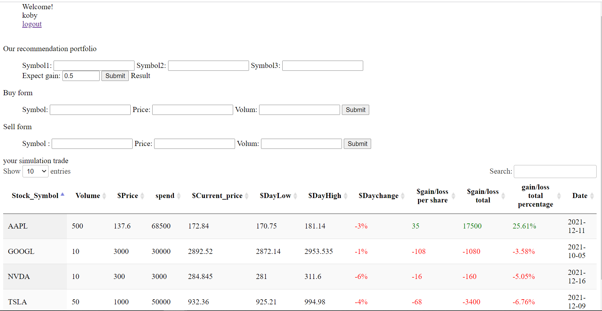

# Server

## Description

This repository is for the server implementation of the fiancial investment Project 
Project website, it might take few seconds to wake up server
https://financialprogramming.herokuapp.com/


## Available Commands

In the project directory, you can run:

```
pip install -r requirements.txt
```
```
npm start
```  

The app is built using `npm init` by nodejs 
Open [http://localhost:5000](http://localhost:5000) to view it in the browser. You also need to run the server file as well to completely run the app. The page will reload if you make edits.
You will also see any lint errors in the console.

## Built With

- JavaScript 
- Python
- Node
- NPM
- MicroSoft Access Database

screenshot page


## 🤝 Support

Contributions, issues, and feature requests are welcome!

Give a ⭐️ if you like this project!